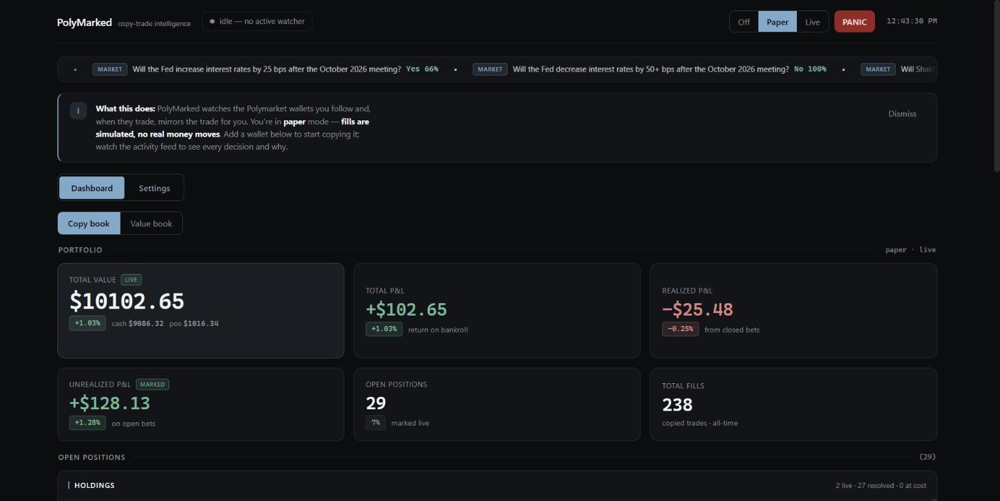
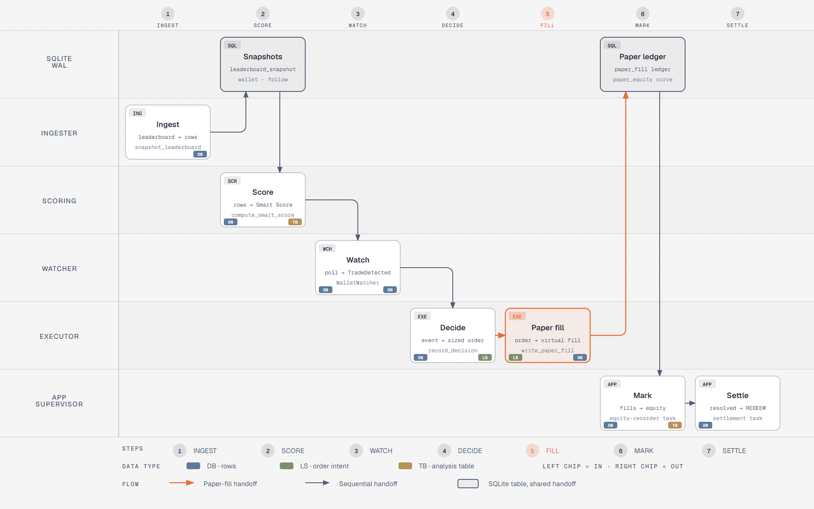
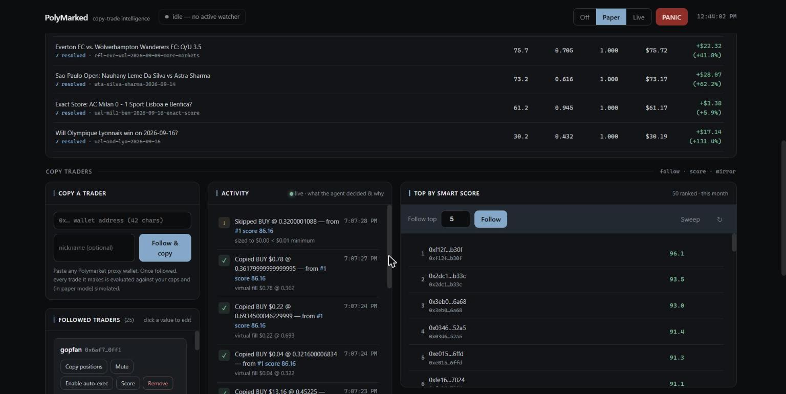
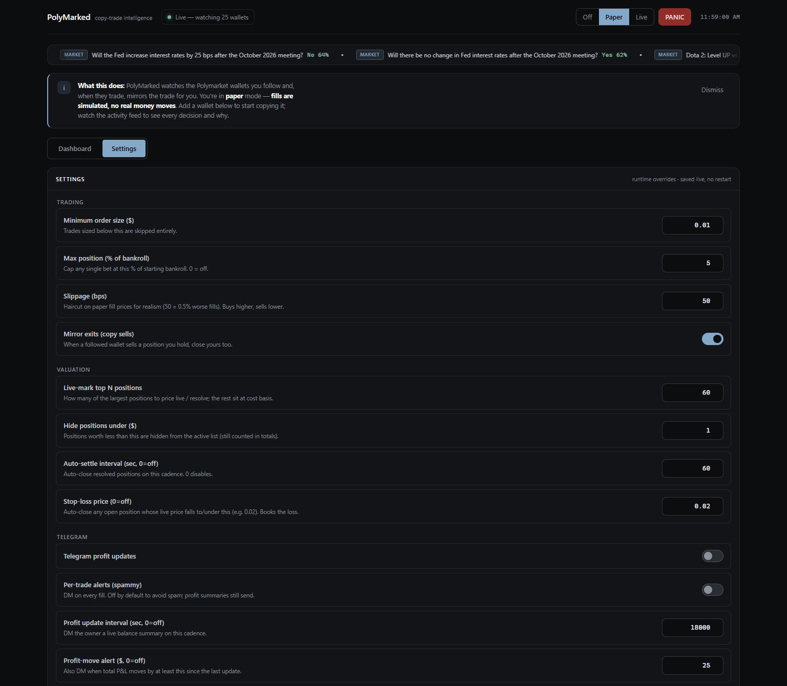

# PolyMarked

**A single-user desktop agent that watches Polymarket wallets, scores them, mirrors their trades into a paper book, and — after the research said copying doesn't work — runs the one edge that survived out-of-sample testing.**

[](https://github.com/aaronk2001/polymarked/actions/workflows/ci.yml)




## Why I built it

Polymarket publishes a public leaderboard and a full per-wallet activity feed, so "find the traders who win and copy them" looks like free money. I wanted to know whether it actually is. That meant building the whole pipeline — ingest, score, watch, decide, fill, mark to market, settle — because you cannot test a copy-trading thesis without a system that records what it *would* have done, at the price it would have gotten, with costs.

The answer turned out to be no (see [What the research found](#what-the-research-found)), which is why the app has two books: the copy book that the thesis lives in, and a value book running the one strategy that held up out of sample. Everything runs on one machine, against a local SQLite file, and nothing signs a transaction unless you explicitly move it to live mode.

<picture>
  <source media="(prefers-color-scheme: dark)" srcset="docs/diagrams/trade-lifecycle-dark.png">
  
</picture>

## Highlights for reviewers

The six places I'd look first, with numbers from the code and the test suite:

1. **REDEEM-aware true PnL.** Polymarket whales often never SELL — they hold to resolution and `REDEEM`, so a naive buy/sell PnL scores them at zero. [`components.py#L20-L70`](packages/scoring/polymarket_agent_scoring/components.py#L20-L70) replays `TRADE`/`REDEEM`/`REWARD` events into a per-`conditionId` position ledger and realizes the whole position when a REDEEM lands. That series then feeds every Smart Score component (profit factor, Sharpe-like, win rate, max drawdown, sample-size confidence, calibration) in [`smart_score.py`](packages/scoring/polymarket_agent_scoring/smart_score.py), plus four red-flag detectors — arb bot, single-trade survivor, recency drought, low effective volume ([`red_flags.py`](packages/scoring/polymarket_agent_scoring/red_flags.py)).
2. **The paper engine is the same engine.** Paper fills aren't a mock: [`paper.py#L97-L137`](packages/executor/polymarket_agent_executor/paper.py#L97-L137) replays the fill ledger into cash plus weighted-average-cost lots and realized PnL, then converts those lots into the *same event shape* the scoring module consumes, so the portfolio number and the Smart Score number can never drift apart under two cost models. Fills take a slippage haircut (50 bps by default) and every decision passes risk caps first — per-trade size, rolling daily loss, position cap at 5% of bankroll ([`risk.py`](packages/executor/polymarket_agent_executor/risk.py), [`sizer.py`](packages/executor/polymarket_agent_executor/sizer.py)).
3. **Three trade modes, and live is a locked door.** `TRADE_MODE=off|paper|live` gates the decision pump. Live can only be turned on in `.env` plus a restart, never from the dashboard or the bot, and every live order also needs the owner's per-wallet `auto_execute` opt-in. There is no model in the trade path. See [Guardrails](#guardrails).
4. **One supervisor, six async tasks, no zombies.** [`supervisor.py#L28-L54`](packages/app/polymarket_agent_app/supervisor.py#L28-L54) kills a stale prior instance by PID lockfile before binding the port or the Telegram poller — that was the fix for launch hangs where a dead instance still held long polling. It then runs API, bot+watcher, equity recorder, settlement, value scan and leaderboard sweep as named tasks in one event loop, cancelling the rest on first exception ([`supervisor.py#L342`](packages/app/polymarket_agent_app/supervisor.py#L342)).
5. **Live mark-to-market, not cost basis.** Open positions are priced against live CLOB mid-prices, at most 8 fetches in flight and cached per token, misses included ([`marks.py#L55-L80`](packages/executor/polymarket_agent_executor/marks.py#L55-L80)), resolved markets are settled on a cadence ([`resolutions.py`](packages/executor/polymarket_agent_executor/resolutions.py)), and an equity recorder snapshots the curve so the dashboard sparkline is real history rather than a redraw of the current number.
6. **Runtime config without a restart.** Every knob in the Settings tab is a row in a runtime-config table that the background loops re-read each tick ([`runtime_config.py`](packages/core/polymarket_agent_core/runtime_config.py), consumed in [`supervisor.py#L304-L340`](packages/app/polymarket_agent_app/supervisor.py#L304-L340)), so changing the sweep cadence or the stop-loss price takes effect on the next cycle. `.env` stays the boot default.

**By the numbers:** 55 tests · 30 API routes · 17 Telegram command handlers · 10 workspace packages, ~5.4k lines of Python · a single-file 1k-line dashboard with no build step, no framework and no dependencies · CI on Ubuntu and Windows × Python 3.11 and 3.12.

## Quick start

Prerequisites: Python 3.11 or 3.12, [uv](https://docs.astral.sh/uv/), and optionally [Ollama](https://ollama.com) with `qwen2.5:0.5b-instruct` for one-line trade summaries in Telegram alerts.

```powershell
uv sync --all-packages
copy .env.example .env
notepad .env                   # TELEGRAM_BOT_TOKEN + TELEGRAM_OWNER_CHAT_ID; leave TRADE_MODE=paper
uv run alembic upgrade head
uv run python scripts/pull_leaderboard.py --top 500 --time-period ALL
uv run python scripts/follow_wallet.py 0x204f72f35326db932158cba6adff0b9a1da95e14 --nickname active-whale
uv run python -m polymarket_agent_app          # window + dashboard + watcher + bot
```

The dashboard is at <http://127.0.0.1:8765> and refreshes every 5 s. Telegram is optional — leave the token blank and the bot simply doesn't start. Build the desktop app and install its icon once with:

```powershell
powershell -ExecutionPolicy Bypass -File scripts/build-exe.ps1      # dist\PolyMarked\PolyMarked.exe
powershell -ExecutionPolicy Bypass -File scripts/install-shortcut.ps1
```

The exe runs migrations on start and reads `.env` and `data/` from the repo root. Rebuild it after pulling code changes; without a build, the shortcut falls back to the `uv` launcher.

## TRADE_MODE

| Mode | What gets recorded | What gets executed | When to use |
|---|---|---|---|
| `off` (code default) | every detected trade as `SKIPPED_DRY_RUN` | nothing | first day, just observing |
| `paper` (`.env.example`) | every detected trade; risk-cap-passed events become virtual fills in `paper_fill` | nothing on chain | validating a strategy |
| `live` | every detected trade; risk-cap-passed events from opted-in wallets sign + post FOK orders | real Polymarket CLOB orders | only with a funded proxy wallet and allowances set |

Set the mode with `TRADE_MODE` in `.env` and restart. The dashboard and the API can step *down* to `paper` or `off` at runtime, but they can't turn live on. `/mode` in Telegram shows the current effective mode.

**Kill switch.** `/panic` disables `auto_execute` on every follow and globally pauses fills. The dashboard's panic button also cancels open CLOB orders when a key is configured. `/unpanic` resumes paper. Live stays off until you opt each wallet back in.

## Guardrails

The design rule: nothing that reasons about markets can place an order. Execution is fixed code behind gates that only the owner can open, and each gate fails closed.

| Gate | Where | What it stops |
|---|---|---|
| Live is config-only | [`system_state.py`](packages/executor/polymarket_agent_executor/system_state.py) | A runtime override can only be `off` or `paper`. `live` needs `TRADE_MODE=live` in `.env` and a restart; the API returns 400 otherwise. |
| Per-wallet opt-in | [`decisions.py`](packages/executor/polymarket_agent_executor/decisions.py) | A live order only happens for a wallet the owner opted in with the Telegram `[Auto-exec on]` button. No size threshold bypasses it. |
| Owner-only bot | [`auth.py`](packages/telegram_bot/polymarket_agent_bot/auth.py) | The bot silently drops every `chat_id` except the owner's. |
| Risk caps | [`risk.py`](packages/executor/polymarket_agent_executor/risk.py), [`sizer.py`](packages/executor/polymarket_agent_executor/sizer.py) | Per-trade max, rolling daily-loss cap, 5%-of-bankroll position cap, minimum order size. |
| Slippage gate | `_execute_live` in [`decisions.py`](packages/executor/polymarket_agent_executor/decisions.py) | Skips a live fill when the book is more than 3% off the target's price. |
| Keys and funds | [`clob.py`](packages/executor/polymarket_agent_executor/clob.py) | Without `POLYMARKET_PRIVATE_KEY`, a funded proxy wallet and on-chain allowances, live orders can't be signed. |
| Kill switch | `/panic` | Turns off every opt-in, pauses fills, cancels open orders (dashboard). |

**Why execution is outside the agent.** Scoring, ranking and the research scripts decide *what looks interesting*. None of them can reach `place_fok`. The only caller is `record_decision`, a plain function whose inputs are the owner's settings and opt-ins. The local model in `packages/llm` only writes a one-line summary onto a Telegram alert. It has no tool calling, it runs after `record_decision` has returned, and it runs in its own task so a slow model can't delay the next decision. The blast radius of a bad output is "a wrong sentence", not "a wrong trade".

**Known limits.** The dashboard API has no authentication. It binds `127.0.0.1` by default and can't enable live, but it can follow and unfollow wallets and toggle panic, so don't expose it. `deploy/polymarked.service` binds `0.0.0.0` for a trusted home LAN and says so in a comment. The live path has unit tests but has not been run with real funds.

## Feature tour

### Copy traders

Follow any Polymarket proxy wallet and every trade it makes is evaluated against your caps. The activity feed is the audit log: each row says what the agent decided and *why* — copied at what price, or skipped because the size fell under the minimum, a cap was hit, or the price sat outside the copy band. The leaderboard panel ranks swept wallets by Smart Score, with a click-through breakdown of the components and red flags behind each number.



### Settings

Trading, valuation, Telegram and auto-sweep knobs, each with the reasoning written next to it. Saved live — the background loops pick changes up on their next tick, no restart.



## What the research found

The repo keeps the negative results because they're the reason the app looks the way it does. Each of these is a script you can re-run:

| Question | Script | Verdict |
|---|---|---|
| Does Smart Score predict *forward* copy return? | [`backtest.py`](scripts/backtest.py) | No — +0.09 Spearman out of sample. It describes the past. |
| Does closing-line value predict it? | [`clv_score.py`](scripts/clv_score.py), [`validate_clv.py`](scripts/validate_clv.py) | No — −0.19 out of sample. |
| Is there a *latency* edge — copy fast enough and ride the drift? | [`copy_latency.py`](scripts/copy_latency.py) | No. Copy-to-resolution is net negative in both cohorts even with a perfect instant mirror. |
| Do consensus signals across wallets help? | [`consensus.py`](scripts/consensus.py) | No — the market is efficient against them. |
| Are prices themselves miscalibrated? | [`calibration_market.py`](scripts/calibration_market.py), [`value_replay.py`](scripts/value_replay.py) | **Yes, narrowly.** Favorite-longshot bias is real, but the broad 0.55–0.85 band *lost* ~2% per bet after costs; only 0.80–0.92 with a tight spread gate stayed positive in both cohorts (+4% recent, +2% OOS at a 2¢ haircut). |

So the leaderboard sweep is kept as ops — it keeps the ranking fresh — not as an edge, and the value book (off by default, `value_enabled`) runs the narrow band with a spread gate, its own bankroll and the same mark-to-market machinery, so the two books can be compared head to head.

## Telegram commands

| Command | Effect |
|---|---|
| `/start` `/help` | greeting + command reference |
| `/list` | every followed wallet, with mute/auto-exec markers |
| `/follow 0x… [nickname]` | add wallet + 24h activity backfill |
| `/unfollow 0x…` | remove |
| `/mute 0x…` `/unmute 0x…` | suppress alerts without removing |
| `/score 0x…` | live Smart Score breakdown |
| `/leaderboard [CATEGORY]` | top-10 from the latest snapshot |
| `/balance` | paper fills + realized PnL + open positions |
| `/mode` | current TRADE_MODE |
| `/panic` `/unpanic` | global kill / resume |

Every alert ships `[View market]` `[Mute]` `[Auto-exec on]` inline buttons.

## Network calls

Everything is local except these, and each one is something you turned on:

- **Polymarket** (`gamma-api`, `clob`, `data-api`) — leaderboard snapshots, per-wallet activity, market prices and resolutions. Read-only unless `TRADE_MODE=live`.
- **Telegram** — long polling, only when `TELEGRAM_BOT_TOKEN` is set. No public URL or webhook, so it works behind home NAT.
- **Ollama** (`127.0.0.1:11434`) — optional, local. Only when a trade alert is sent; if the daemon isn't running the alert goes out without a summary.
- **Polygon RPC** — only on the live path (allowance approvals, order signing). Never touched in `off` or `paper`.

The database is a local SQLite file (`./data/polymarked.db`, override with `DATABASE_URL`), the API binds `127.0.0.1` by default, and `data/`, `.venv/` and `.env` are gitignored.

## Project layout

```
packages/
  core/          config, db, http, ORM, schemas, runtime config, structlog setup
  ingester/      leaderboard + per-wallet /activity pullers, leaderboard sweep
  scoring/       Smart Score components, red flags, explain
  watcher/       per-wallet polling, TradeDetected events, persistence
  executor/      sizer, risk caps, paper ledger, marks, resolutions, value strategy
  telegram_bot/  owner-gated bot + alerts pump + admin commands
  api/           FastAPI dashboard backend (127.0.0.1 by default)
  llm/           Ollama narration for trade alerts (no-ops if Ollama is down)
  app/           desktop entrypoint (pywebview window), supervisor
  dashboard/     single-file HTML, auto-refreshing every 5 s
scripts/         ingest + ops (pull_leaderboard, follow_wallet, score_wallet, top_scores)
                 and the research suite (backtest, clv_score, validate_clv, consensus,
                 calibration_market, copy_latency, value_replay)
alembic/         migrations: 0001 initial schema, 0002 paper_fill + system_kv
tests/           unit + integration markers (network/integration tests skipped in CI)
```

## Status

- [x] **Phase 0–3** — uv workspace, SQLite + Alembic, leaderboard ingester, Smart Score engine, wallet watcher with 24h backfill and cursor pagination, owner-gated Telegram bot.
- [x] **Phase 4a** — `TRADE_MODE off|paper|live`, sizer, risk caps, paper ledger, decision pump. Backtest replay of 1,500 events → 231 paper fills.
- [x] **Phase 5** — FastAPI dashboard at `127.0.0.1:8765`, supervisor running watcher + bot + API in one event loop, native pywebview window.
- [x] **LLM narration** — Telegram trade alerts carry a one-line summary from a local `qwen2.5:0.5b-instruct`, sent off the decision path with a 30 s timeout.
- [x] **Research + value book** — copy-edge tests, calibration study, favorite-longshot strategy in its own book.
- [x] **PyInstaller `.exe`** — `scripts/build-exe.ps1` builds a one-folder, no-console `PolyMarked.exe`; the Desktop shortcut launches it.

Personal project. No license granted.
